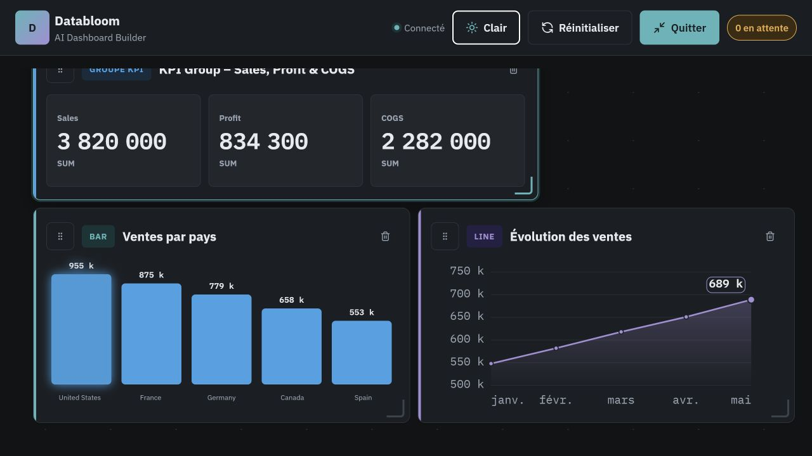
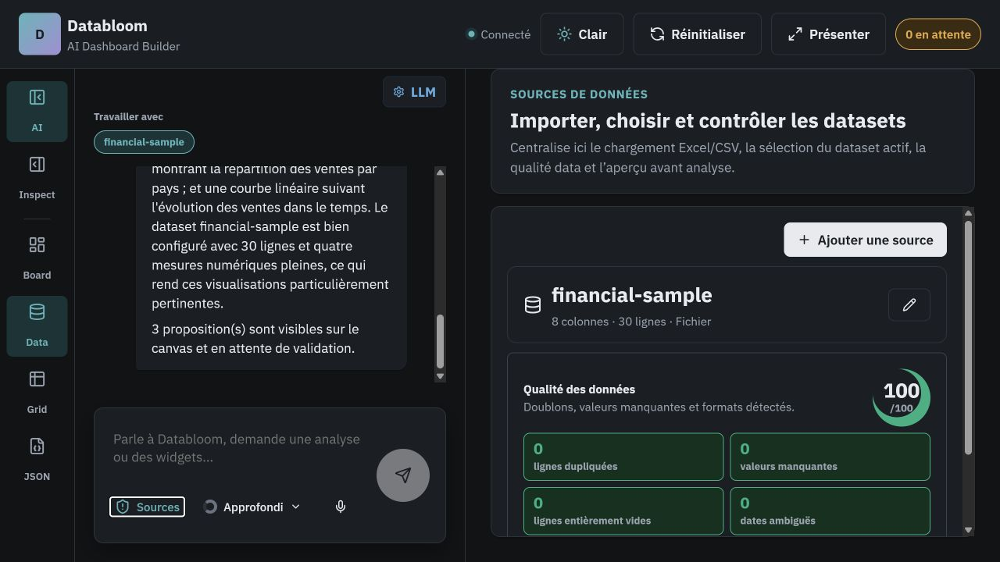

<div align="center">

# DataBloom

### Transformez vos données en tableaux de bord interactifs, simplement en les décrivant.

[](https://github.com/dandyArise/data-bloom/actions/workflows/quality.yml)
[](https://dandyarise.github.io/data-bloom/)
[](https://react.dev/)
[](https://www.typescriptlang.org/)
[](https://vite.dev/)
[](LICENSE)

DataBloom est un générateur de tableaux de bord assisté par IA, conçu pour fonctionner en local. Importez un jeu de données, demandez une analyse en langage naturel, puis acceptez, déplacez, redimensionnez ou supprimez les composants visuels proposés par l'assistant.

</div>



## Ce que DataBloom sait faire

- **Construire par conversation** — l'assistant génère des propositions structurées à partir d'une consigne, avec validation avant leur ajout à l'espace de composition.
- **Importer des données réelles** — CSV, TSV, XLS, XLSX, XLSM et XLSB, mais aussi API HTTP et sources de supervision HTTP, DNS ou ping.
- **Contrôler la qualité** — détection des doublons, valeurs manquantes, lignes vides et dates ambiguës avant l'analyse.
- **Analyser intelligemment** — distinction entre mesures, dimensions et identifiants numériques pour éviter les agrégations absurdes.
- **Composer librement** — déplacement, redimensionnement, suppression, inspection et édition de chaque composant visuel.
- **Piloter par commandes** — tapez `/` dans la conversation pour afficher le catalogue, puis utilisez par exemple `/pie`, `/heatmap` ou `/kpi-group`.
- **Présenter et exporter** — thèmes clair et sombre, mode présentation, aperçu JSON et génération de `workflow.yml`.

## Catalogue des composants visuels

Les composants Bloom sont isolés de l'interface applicative et partagent un contrat de données stable.

| Famille | Types disponibles |
|---|---|
| Indicateurs | `kpi`, `comparison`, `kpi-group` |
| Graphiques | `bar`, `line`, `pie`, `heatmap` |
| Données et contenu | `table`, `text`, `note` |
| Supervision | `service-status`, `threshold-line`, `radial-gauge`, `availability-grid` |

Chaque rendu possède un état vide explicite. Les graphiques temporels affichent leurs axes, leur échelle et une hiérarchie visuelle cohérente ; les composants de supervision utilisent des couleurs fondées sur des seuils plutôt que sur le nom des champs.



## Démarrage rapide

### Prérequis

- [Node.js 22+](https://nodejs.org/)
- [pnpm 11.9+](https://pnpm.io/)
- Facultatif : [LM Studio](https://lmstudio.ai/) pour utiliser l'assistant local

```powershell
git clone git@github.com:dandyArise/data-bloom.git
cd data-bloom
pnpm install
pnpm dev
```

Ouvrez ensuite [http://127.0.0.1:5173](http://127.0.0.1:5173). Un jeu de données financier prêt à importer est fourni dans [`examples/financial-sample.csv`](examples/financial-sample.csv).

## Connecter un modèle local

1. Lancez le serveur local de LM Studio sur le port `1234`.
2. Chargez explicitement le modèle que vous souhaitez utiliser.
3. Dans DataBloom, ouvrez **LLM** et conservez l'URL `/lmstudio/v1`.
4. Sélectionnez le modèle détecté, puis testez la connexion.

En développement, Vite relaie `/lmstudio` vers `http://127.0.0.1:1234`. DataBloom utilise les points de terminaison compatibles avec OpenAI `/models` et `/chat/completions`. La configuration reste dans le navigateur ; aucun service distant n'est requis pour le mode local.

## Architecture

```text
src/
├── app/                     # orchestration, données, conversation, état et interface
│   ├── components/          # vues et contrôles de l'application
│   ├── hooks/               # contrôleur et état de l'espace de travail
│   ├── datasetImport.ts     # import et normalisation des jeux de données
│   ├── dataProfiling.ts     # profilage sémantique des champs
│   └── widgetDataAdapter.ts # adaptation Dataset → WidgetData
└── bloom/                   # bibliothèque de composants visuels autonome
    ├── registry.ts          # registre extensible des composants
    ├── types.ts             # contrat public WidgetData / WidgetConfig
    ├── tokens.css           # variables de design pour les thèmes clair et sombre
    ├── widgets/             # un module par type de composant
    └── dev/                 # banc de test du rendu isolé
```

L'interface applicative importe Bloom uniquement via `@bloom/index`. Les composants visuels ne connaissent ni la conversation, ni les jeux de données de l'application, ni le stockage : l'adaptateur traduit les données métier vers le contrat public de Bloom. Les règles ESLint empêchent les dépendances inverses.

Pour ajouter un composant visuel, créez son module sous `src/bloom/widgets/`, enregistrez-le dans le registre Bloom, puis ajoutez son adaptateur dans `src/app/`. La commande `/` correspondante est générée automatiquement depuis le registre.

## Commandes utiles

```powershell
pnpm dev               # serveur de développement
pnpm check:boundaries  # architecture et analyse statique stricte
pnpm build             # TypeScript et compilation de production
pnpm preview           # prévisualisation de la version compilée
```

Le banc de test autonome des composants est accessible en développement sur `/src/bloom/dev/harness.html`.

## Sécurité de la chaîne de dépendances

L'espace de travail pnpm impose un délai minimal avant l'installation des nouvelles versions publiées et bloque les rétrogradations de confiance. Ces protections réduisent l'exposition aux paquets compromis fraîchement publiés. Les clés d'API éventuelles doivent rester locales et ne doivent jamais être ajoutées au dépôt.

## Contribution

Les tickets et demandes de fusion sont les bienvenus. Avant de proposer un changement, exécutez au minimum :

```powershell
pnpm check:boundaries
pnpm build
```

## Licence

DataBloom est distribué sous licence [0BSD](LICENSE) : utilisation, modification et redistribution sans restriction, dans les limites précisées par la licence.

<div align="center">

Créé par [dandyArise](https://github.com/dandyArise).

</div>
